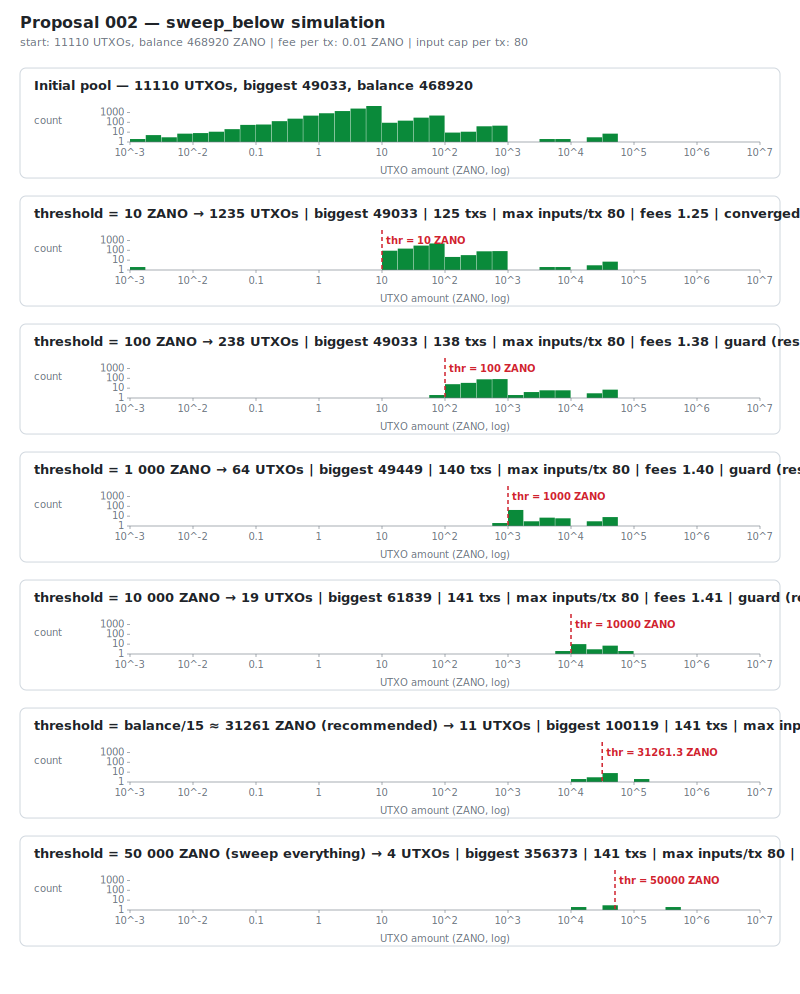

# Keeping Your Wallet's UTXO Set Healthy

If you run a Zano wallet that processes many transactions — an exchange hot
wallet, a payment processor, a high-volume merchant, or simply an
individual who has received many small payments over time — your wallet's
UTXO set can drift toward an unhealthy shape: lots of small UTXOs and very
few large ones.

When this happens, building a large outgoing transaction has to gather many
small UTXOs, and eventually hits one of two hard limits:

- The maximum number of inputs per transaction.
- The maximum transaction size on the network.

At that point, large withdrawals start failing — even though the wallet
balance is plenty to cover them.

This guide explains how to **inspect** and **maintain** a healthy UTXO
distribution using two wallet RPC methods.

---

## 1. Why UTXO shape matters

Your wallet's coin-selection logic prefers to spend the smallest UTXO that
can cover the amount being sent. When that doesn't exist, it falls back to
combining several. As a rule of thumb:

- **Few large UTXOs** → any withdrawal (small or large) uses just 1–2
  inputs. Transactions stay small, cheap, and reliable.
- **Many small UTXOs** → small withdrawals work, but large ones balloon to
  hundreds of inputs and eventually fail.

The goal of UTXO maintenance is to keep the wallet biased toward the first
shape.

---

## 2. Inspect: `get_utxo_stats`

The
[`get_utxo_stats`](https://docs.zano.org/docs/build/rpc-api/wallet-rpc-api/get_utxo_stats)
wallet RPC returns a histogram of your current UTXOs by amount. This is
the right starting point: run it before doing anything else, so you know
whether maintenance is actually needed.

A typical "unhealthy" output shows tens of thousands of UTXOs concentrated
in the low buckets (e.g. under 10 or under 100 coins), with only a handful
in the higher buckets. A typical "healthy" output shows a small total
count (tens, not thousands) with most of the balance in the largest
bucket.

You can call `get_utxo_stats` periodically as a monitoring signal:
**if the count of UTXOs below your target threshold grows past a few
hundred, schedule a maintenance run.**

---

## 3. Consolidate: `sweep_below`

The
[`sweep_below`](https://docs.zano.org/docs/build/rpc-api/wallet-rpc-api/sweep_below)
wallet RPC is the right tool to fix an unhealthy distribution. It:

1. Collects every spendable UTXO whose amount is **less than** the
   `amount` threshold you pass in.
2. Sorts them **biggest first** and bundles them into a single
   transaction that sends the consolidated total back to the address
   you specify (typically **your own wallet address**).
3. The result: many small UTXOs in → one large UTXO out, per
   transaction.

> **`sweep_below` now supports assets.** Use the `asset_id` field to
> consolidate balances of a specific confidential asset; omit it to
> consolidate the native ZANO balance. See the
> [`sweep_below` reference](https://docs.zano.org/docs/build/rpc-api/wallet-rpc-api/sweep_below)
> for the full parameter list.

A single `sweep_below` call produces **one** transaction. Because each
transaction has a maximum input count, you usually need **a series** of
calls to fully normalize a wallet that has drifted badly.

---

## 4. Recommended procedure

Run the following procedure when `get_utxo_stats` shows an unhealthy
distribution:

### Parameters

| Parameter | Recommendation |
|---|---|
| **`amount` (threshold)** | **5000 coins** for wallets with significant balance. If your total balance is low (e.g. under ~50,000 coins), use a smaller threshold so that consolidation still leaves you with multiple usable UTXOs — a good rule is `threshold = balance / 10`, capped at 5000. |
| **`address`** | Your own wallet's primary address — you are consolidating into one new big UTXO for yourself. |
| **`mixin`** | Use the same value you use for regular transfers (typically 15). |
| **`fee`** | The current network minimum fee (0.01 ZANO at time of writing). |
| **`asset_id`** | Omit for native ZANO. Set explicitly when consolidating a specific asset. |

### Pacing

- **Do not run more than 10 `sweep_below` transactions in a single
  batch.** Beyond that you risk overloading the daemon, conflicting
  with normal traffic, and producing more unconfirmed transactions
  than the network is ready to process.
- **Wait at least 30 minutes between batches.** Thirty minutes is
  enough for the previous batch's transactions to confirm so the next
  batch starts from a clean, observable wallet state. If you don't
  wait, your wallet's coin-selection sees temporarily-locked inputs and
  may produce conflicting consolidations.
- **Stop when there is nothing left to sweep.** Each `sweep_below`
  response includes two counters:
  - `outs_total` — the total number of UTXOs below the threshold that
    the wallet found.
  - `outs_swept` — how many of them were actually consolidated into the
    transaction that was just built.

  When `outs_swept == outs_total`, the wallet swept **every**
  sub-threshold UTXO in a single transaction — there is nothing left
  to consolidate and you should stop calling `sweep_below` until more
  small UTXOs accumulate (typically the next maintenance window).
- **Treat a `sweep_below` error the same way.** If the call returns an
  error (for example because there are no spendable sub-threshold
  outputs left, or none that satisfy the mixin requirement), the
  wallet has nothing to sweep — stop the current batch.
- After each batch, call `get_utxo_stats` again to check progress.
  Stop when the low-bucket count is under a few dozen.

### Pseudocode

```pseudo
threshold = min(5000, total_balance / 10)
hot_addr  = "<your wallet primary address>"

while True:
    stats = rpc.get_utxo_stats()
    if stats.utxos_below(threshold) <= TOLERANCE:   # e.g. 30
        break                                       # we're healthy

    done = false
    for i in 1..10:                                 # at most 10 per batch
        try:
            resp = rpc.sweep_below({
                mixin:    15,
                address:  hot_addr,
                amount:   threshold,
                fee:      MIN_FEE,
            })
        except RpcError:
            done = true                              # nothing left to sweep
            break

        if resp.outs_swept == resp.outs_total:
            done = true                              # everything below threshold
            break                                    # was consolidated in one tx

    if done:
        break                                        # full normalization complete
    sleep(30 minutes)                                # let txs confirm before next batch
```

### Frequency

For wallets that are heavily used (multiple withdrawals per hour), schedule
this procedure to run **daily** during a low-traffic window. For wallets
that are mostly idle, **weekly** is plenty.

If your wallet is severely unhealthy when you start (tens of thousands of
small UTXOs), the first full normalization will take many batches —
possibly spread over several days at the 10-per-30-min pacing. After
that, daily/weekly maintenance keeps it healthy with very little work.

---

## 5. Example: how many transactions does it take?

To give you a realistic picture, the chart below shows a simulation
starting from a deliberately unhealthy distribution:

- 10,000 UTXOs of less than 10 ZANO
- 1,000 UTXOs of 10–100 ZANO
- 100 UTXOs of 100–1,000 ZANO
- 10 UTXOs of 1,000–50,000 ZANO

(Total: 11,110 UTXOs, ~470,000 ZANO balance.)

Six different threshold choices were simulated. For each, the chart shows
the resulting UTXO histogram and how many `sweep_below` transactions
were needed to get there.



### Reading the numbers

| Threshold | Final UTXO count | Biggest UTXO | Transactions needed |
|---|---:|---:|---:|
| 10 ZANO | 1,235 | 49,033 | 125 |
| 100 ZANO | 238 | 49,033 | 138 |
| 1,000 ZANO | 64 | 49,449 | 140 |
| 10,000 ZANO | 19 | 61,839 | 141 |
| 31,261 ZANO (≈ balance ÷ 15) | 11 | 100,119 | 141 |
| 50,000 ZANO (sweeps everything) | 4 | 356,372 | 141 |

A few observations:

- **Total transaction count is roughly the same** (125–141) regardless of
  threshold. The work is dominated by draining the ~10,000 tiny UTXOs
  through the per-transaction input cap.
- **Higher thresholds give you fewer, larger output UTXOs** — i.e. a
  healthier-looking end state.
- **Aggressive thresholds (sweep everything) collapse the wallet to very
  few outputs** (3–4), which works but sacrifices the ability to run
  many withdrawals in parallel. The "balance ÷ 15" zone is a good
  middle ground.
- **At the recommended 10-tx-per-30-min pacing**, the full normalization
  in this example takes about **141 ÷ 10 = 14 batches**, i.e. about
  **7 hours** of clock time. After that, daily maintenance with the
  same procedure keeps the wallet healthy with only a few transactions
  per run.

---

## 6. Quick reference

| Action | RPC method | When |
|---|---|---|
| Check current UTXO distribution | [`get_utxo_stats`](https://docs.zano.org/docs/build/rpc-api/wallet-rpc-api/get_utxo_stats) | Always run first; also use for monitoring |
| Consolidate small UTXOs | [`sweep_below`](https://docs.zano.org/docs/build/rpc-api/wallet-rpc-api/sweep_below) | When small-bucket count grows past a few hundred |

### Rules of thumb

- **Threshold**: 5000 coins for high-balance wallets; `balance ÷ 10`
  capped at 5000 for smaller wallets.
- **Batch size**: at most 10 `sweep_below` transactions in a row.
- **Pacing**: wait at least 30 minutes between batches.
- **Stop condition**: when `outs_swept == outs_total` in a `sweep_below`
  response (or the call returns an error) — the wallet has nothing
  more to consolidate.
- **Cadence**: daily for busy wallets, weekly for quiet ones.
- **Assets**: pass `asset_id` to `sweep_below` to consolidate a specific
  confidential asset; omit it for native ZANO.

A healthy wallet is one where any reasonable withdrawal — small or large —
can be built from 1–2 inputs. Running this procedure on a regular schedule
keeps it that way with minimal overhead.
